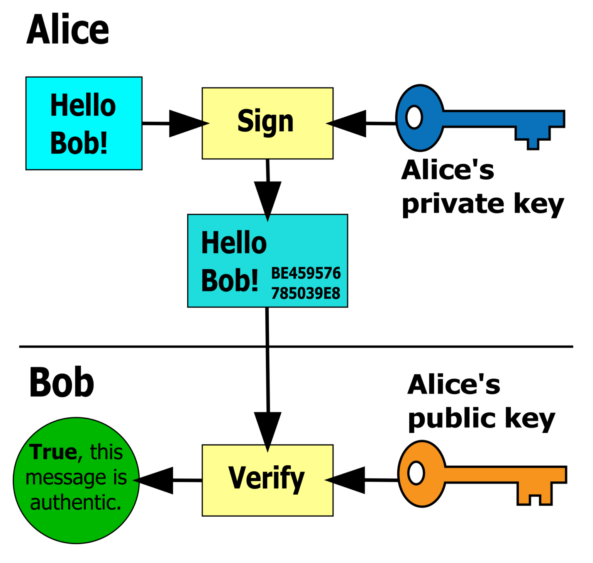

# Digital Signatures and Key Exchange

## Digital Signatures

Digital signatures are a way of verifying that a piece of data or information has not been spoofed or tampered with. A sender can encrypt a piece of data or information with their private key and attach the output of the message as a digital signature. The receiver then can take in the message and use the combination of the public key and their own computed hash to ensure that the message has not been changed in any way by comparing the digital signature hash with their own.

## Key Exchange

Key Exchange allows two hosts to know the same symmetric encryption key without any other host finding out what it is-this is typically known as a session key.

1. A sender uses the recipients public key to encrypt a secret key
2. The recipient then uses their private key to decrypt and retreive the secret key
3. The recipient then uses the secret key to decrypt the information