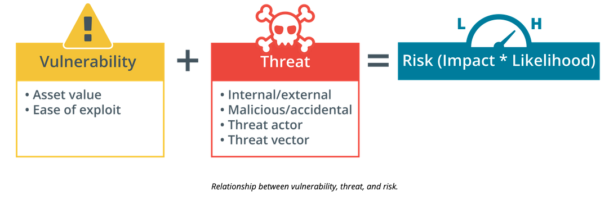

# Information Security

Information security encompasses the level of which people and systems have access to resources, or don't have access to resources. There are three major components to information security.

1. Confidentiality - there are pieces of data or information that should only be known by systems or people
2. Integrity - validates that any data stored or being transferred is unmodified by unauthorized resources
3. Availability - data/information is present and available to those whom have access to it and request it

## Cybersecurity

Cybersecurity is the practices of the three main components of information security in various formats and the controls necessary to protect resources from attacking threat actors

## Security Assessments

Security assessments evaluate three different components of technology

1. **Vulnerability** - is an open point within an application or resource which exposes it to attacks or being used by undesired parties
2. **Threats** - Threat actors come in many different shapes. Threats can be from physical and virtual form, they can be people directly attempting to exploit a system or tool, or they can be bots crawling through the internet attempting to take over machines, or bots may intrude undetected and silently send information or wait for commands from a server.
3. **Risk** - is the analysis of assets or resources within a scope that may be open to attack in various ways and providing a metric to understand the likeness of attack or exposure.

