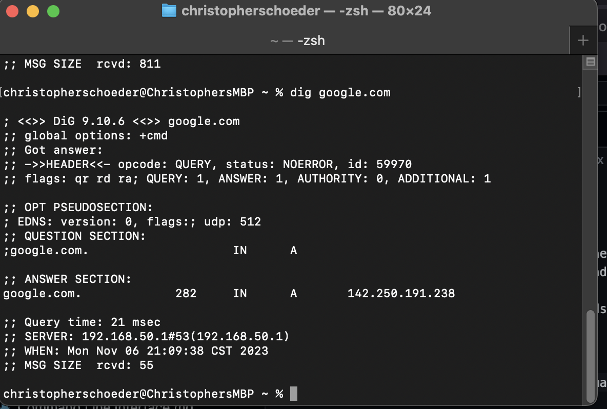

# Network Management Commands

## ip Command

Historically called `ifconfig` the new package on linux system uses the `ip` command for output to display the different adapters and their assignments for IPv4, DHCP, Subnetting, Gateways, IPv6, and MAC Addresses assigned to the NICs (if there are more than one) on your system.

You can also use the various commands that come with `ip` enable, disable, release, or refresh connections

## dig Command

the `dig` command can provide information about a domain or server

## samba Command

Samba provides an interface between windows and linux system for connection workstations to each other.