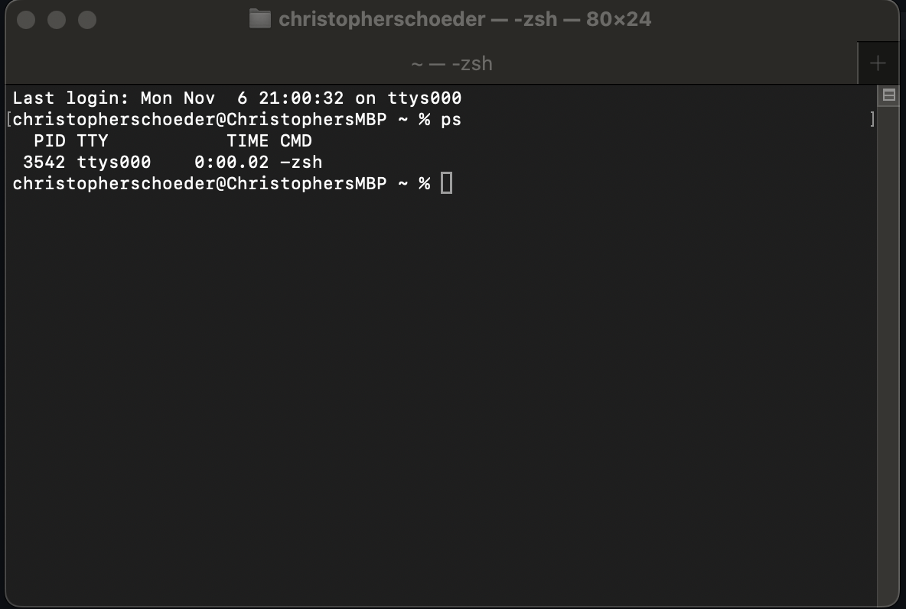

# Process Monitoring Commands

## Summary

On summary you can view the processes running on the system and view the resources which are being utilized with various metrics using the `ps` and `top` command(s).

## ps Command

`ps` will output similar information as below in the terminal (by default on MacOS)

## top Command

The `top` command will display all the processes running on the linux system. This can act like a Windows Task Manager tool for Microsoft Windows. Users are able to see all the process, whom is running them, the resources that are being used to run them, etc. Additional flags will add or remove information as well.