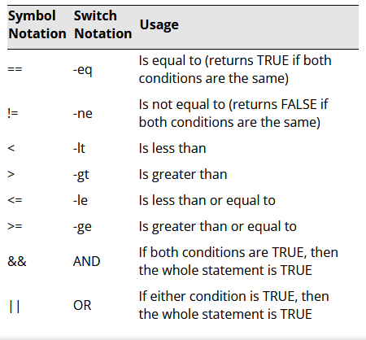

# Basic Script Constructs

## Commonts

Comments are often put into scripts with the '#' leading character followed by any words or description for the task

## Variables

You can declare variables using different syntax for each operating system. 

Linux uses simple word and assignment like so, `MY_VARIABLE_NAME=Hello World` which then can be used like `echo $HELLO_WORLD`

You can think of variables as aliases to other computations that were made before or as ways of storing configurations that will be used later on.

## Branching

Branching is a way of defining what to do if a condition is or is not met. For example you may want to run a command only if the user passes a `1` as the first argument to running your script so you would check

```sh
if [-z "$1" ] # -z tests whether the first positional parameter $1 is unset or empty
then
    echo "You entered 1"
else
    echo "You didn't add anything"
fi
```

## Loops

Loops are a way of repeating a process a number of times or until a condition is met and you leave the loop.

For example you may have a counter

```sh
for i in {1,2,3,4,5,6,7,8,9}
do
    echo "$i"
done

# prints..
# 1
# 2
# 3
# 4
# 5
# 6
# 7
# 8
# 9
```

## Operators

Operators are a way of checking for a condition in a loop or for branching as a way of making a dicision on which direction a program should execute the next instruction.

