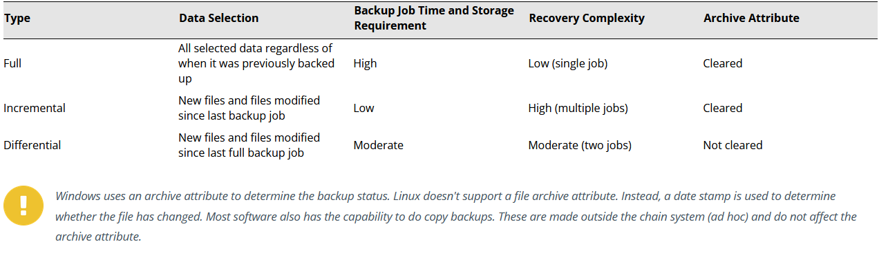

# Backup Methods

## Main factors of backup operations

- Frequency - frequency referes to how often a system is backed up and what the duration is between each backup. You may only need a snapshot between each or you may require entire historical versions of a file or directory.
- Retention - Retention is the period of time something is kept around before it is flagged for removal on a system.

## Backup Chains

### Summary

Backup chains are limited by the amount of storage available in the backup center and the time it takes to backup systems.

### Implementation

- Full Only - This takes a backup of all data from the source and requires the most storage space
- Full with incremental - Lowest time management for running and takes a full backup and then slowly files the newer files and folders to backup.
- Full with differential - this means that the chain starts with a full backup and then runs the differential jobs that select new files and files modified since the original job as ran.

## Synthetic Backup

A Synthetic backup is an option for creating full backups with lower data trnasfer requirements. 

1. Chain runs full backup and then makes incremental backups
2. When the next full backup is scheduled, the backup software makes one more incremental backup. It then synthesizes a new full backup from the previous full and incremental backups.