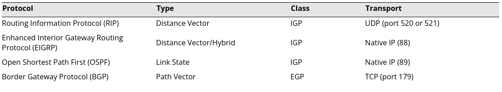

# Compare and Contrast Dynamic Routing Concepts

# Objectives

1.4 Given a scenario, configure a subnet and use appropriate IP address schemes.
2.2 Compare and contrast routing technologies and bandwidth management concepts.

## Dynamic Routing Protocols

Dynamic routing protocols focus on the ability to build routing information at each router and the path priority for different network traffic. Information can be shared with peer routers.

### Topology and Metrics

- distance vector - used by routers to determine the lest amount of hops to get to destination network
- link state - link state is a generic way of saying "we're just going to keep calculating the algorithm"

### Convergence

Convergence is the way routers can communicate and work together to agree on the best path forward for sending packets.

## Interior versus Exterior Gateway Protocols

### Autonomous Systems

Autonomous systems are systems that are controled by a single administrator to determine the best route for traffic that uses Interior Gateway Protocol (IGP).

### Exterior Gateway Protocol

Exterior Gateway Protocol is a system which communicates between multiple autonomous systems to determine the best path forward for traffic.

