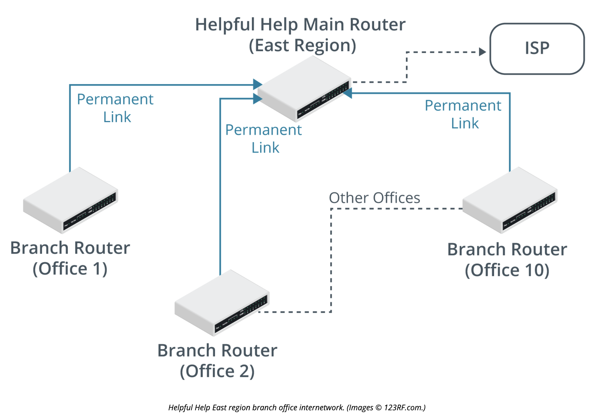
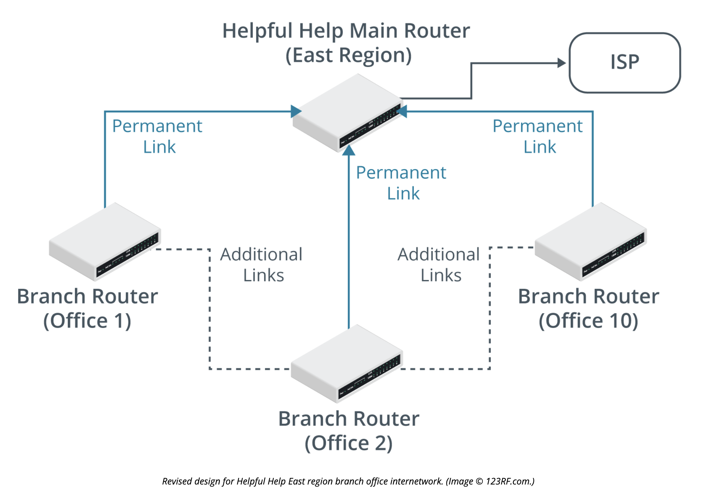

# Install and Troubleshoot Routers 

# Objectives

1.4 Given a scenario, configure a subnet and use appropriate IP addressing schemes (subinterfaces only)
2.1 Compare and contrast various deviecs, their features, and their appropriate placement on the network.
5.3 Given a scenario, use the appropriate network software tools and commands.
5.5.Given a scenario, troubleshoot general networking issues 

## Edge Routers

Used by organizations to provide access to External Networks coming in.

### Key Functionality

1. Routing
2. Network Address Translation (NAT)
3. Firewalling
4. VPN Termination
5. Traffic Shaping and QoS
6. Redundancy and High Availability

## Internal Routers

An internal router has no access to a public network. An internal router is meant to implement whatever topology is necessary for subnetting or forwarding traffic.

### Subinterfaces

A sub interface can be created using a router and a Virtual (LAN) where a single interface can span to several other virtually created interfaces on the network.

### Layer 3 Switch

A layer 3 switch can create a virtual lan and forward traffic to the appropriate network interfaces. This is more efficient than passing traffic between a switch and a router.

## Router Configuration

A router is best configured over a network using a virtual interface and ssh tunnel rather than a physical interface in the event that a fault occurs and a physical interface used specifically for configuration no longer is available.

## Route cmd

Route is a cmd is used on Windows and Linux Systems to modify the routing table of the end system windows and linux hosts.

## Tracert and Traceroute

### Traceroute

Traceroute is supported by LInux and router Operating Systems that uses UDP probing messages by default to find a broken path between node(s).

Traceroute uses a TTL (Time to Live) of 1 and the port 32767. The first hop should reduce this to zero and respond with an ICMP Time Exceeded message.

## Tracert

Tracert is a windows system specific command that uses ICMP Echo Request pobles by default. the command issues an Echo Request probe with a TTL (Time to Live) of 1.

## Routing Loops

A routing loop occurs when two or more nodes participate and forwarding a packet as "best path forward" in a routing table until the TTL expires.

### Possible Solutions

Using a distance vector calculation these are some strategies that can help mitigate a circular loop

- Maximum Hop Count - A maximum number of hops that is flaged as a "poison" route typically set at about TTL 16
- Holddown timer - Occurs when a router receives information about a poison route. If any other routers tell that router about that same route it is ignored until the holddown is over.
- Split horizon - Prevents a routing updated from being copied back to the originator.

## Asymetrical Routing Issues

Asymetrical routing issues occur when the path to the destination is different than the path from destiation to source. The most common scenario is load balances or gateways`

## Review Activity:

1. A router must forward traffic received over a single physical interface connected to a switch trunk port to the appropriate virtual LAN (VLAN). What feature must be configured on the router?

> A subinterface for each VLAN carried over the trunk. Each subinterface must be configured with an IP address and mask for the subnet mapped to the VLAN.

2. True or false? Layer 3 capable switches are interchangeable with routers.

> False. A layer 3 capable switch can perform fast routing and switching between subnets and virtual LANs (VLANs) on a local network. However, a layer 3 switch does not typically support WAN interface cards and so cannot be used as an edge router.

3. True or false? Any occurrence of an asterisk in traceroute output indicates that there is no connectivity the destination along that path.

> False. Some routers along the path might not respond to probes. If there is no route to the destination, an unreachable notification will be displayed.

4. Your network monitor is recording high numbers of ICMP Time Exceeded notifications. What type of routing issue does this typically indicate?

> This is typical of a routing loop, where packets circulate between two routers until the time to live (TTL) is exceeded.

5. A campus to datacenter fiber optic link has been laid over 15 km of single mode fiber with one fusion splice along this run. The termination at each end requires two connectors. You need to evaluate a proposal to use 10GBASE-LR transceiver modules for the router. The module specification quotes Tx power of –8.2 dBm and Rx sensitivity of –14.4 dBm. Assuming attenuation of 0.4 dB/km, 0.75 dB loss per connector, and 0.3 dB loss per splice, do these modules work within the expected loss budget?

> The loss budget is (15 * 0.4 = 6) + (2 * 0.75 = 1.5) + (1 * 0.3 = 0.6) = 7.8 dB. The power budget is –8.2 – 14.4 dBm = 6.2 dB. Consequently, the power budget is insufficient. Note that 10GBASE-LR is rated for 10 km operation over single mode. 

### Review Activity Part 2

Helpful Help is a charitable organization that operates out of numerous small offices spread all over the country. Each office has a team of 10–20 people who currently use a network of PCs and Apple Macs running various applications. Each office is connected back to a main site, which has a connection to the Internet via an ISP. Staff at each local office uses the link for web access and to access an online email service. Each office has a 192.168.x.0/24 subnet allocated to it. The East region is shown in the graphic.

Using the above scenario, answer the following questions:

1. Given the current scenario of the charity, how would the routers at each local office be configured?

Presently, each local office has several PSTN (landline) telephones. The plan is to replace these with a unified communications system for VoIP, conferencing, and messaging/information. This will require devices in each local office to be able to contact devices in other offices for direct media streaming. It is also anticipated that additional links may be added between branch offices where larger numbers of users are situated due to the increased bandwidth required by the new applications at this site. Here is the revised diagram:

> As the link is only used for web browsing and online email, the local office routers would just be configured with a static route/default gateway/gateway of last resort to forward all traffic to the main site, which would forward the web traffic on.

2. With this new infrastructure in place, what changes would need to be made to the router's configuration?

> Due to the need for offices and therefore routers to be able contact each other, additional routing table entries will be needed. This could be through more static routes, but a dynamic routing protocol would be better able to cope with any future changes to the topology.

3. Which protocol would be best here?

> There are several choices. The network is relatively simple with only a few network hops, so RIPv2 could be used as it is easier to configure. 

If the new system works well in the East region (the smallest), the plan is to roll out the system to the three other regions (North, South, and West). This will involve connecting the main routers for each region together, plus some additional links for redundancy. The other regions use different IP numbering systems and some use VLSM.

4. Considering the potential changes a successful pilot in the East region might bring about in the whole organization, would your router configuration options change? 

> Due to the potential increase in the number of routers and subnets, OSPF may be the better choice of dynamic routing protocol. This is especially true due to potential IP subnet numbering differences, including VLSM. 

5. What might you do to manage the much larger number of IP subnets?

> It may be worth considering different OSPF areas to manage the size of the OSPF topology tables and use route summarization to reduce the router's CPU load.
