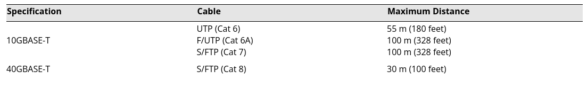

# Gigabit ethernet Standards

## Summary

Gigabit Ethernet Standards are built ontop of Fast Ethernet Standards at a rate of 1Gbps (Gigabit per second) or up to 10 Gigabits per second.

### Limitations

- Typically limited to copper as most systems or workstations support legacy copper systems
- Can only travel about 100 meters or 328 feet
- Is not supported with Hubs, only supported with switches between nodes
- Can only be ran on short distances with unsielded twisted pair cables

