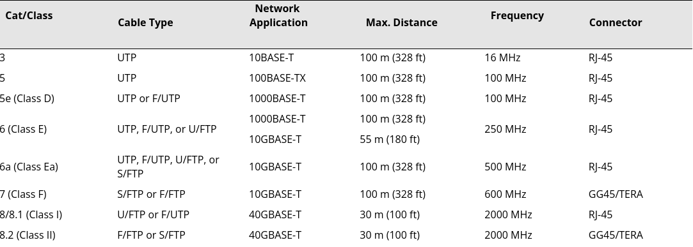

# Cat Cable Standards

## Summary

There are many categories and ongoing developments for standards that are being developed for cables, tranmittion rates, singal strenght, packet sizes, etc. network interfaces, etc. the American National Standards Instituite (ANSI) along with the help of the Telecommunications Industry Asociation (TIA), and the Electronic Industries Alliance (EIA) developed frequencies, terminator types, such as RJ-11 or RJ-45, frequencies, etc. for each cable type.

## Sample Image

