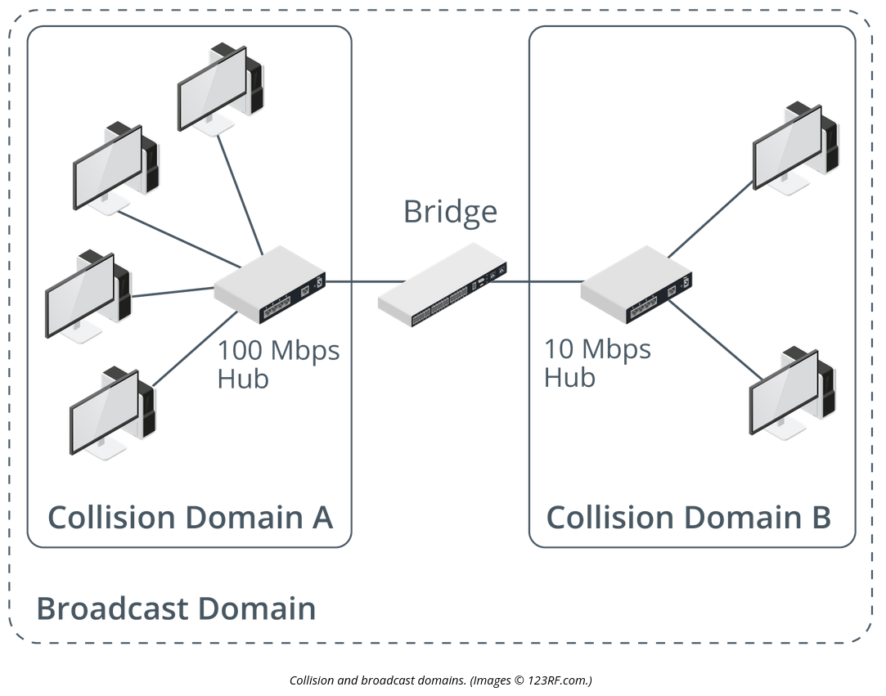

# Bridges

## Summary

A bridge is a system that allows for separate networks but connects them together to broadcast in the same domain.

## Smart(er) devices

A bride is a smarter device in that it limits the collision domains by only forwarding the traffic necessary to go to a different collision domain if the address is found there. Otherwise the traffic is not forwarded and the bandwidth is saved in the other collision domain.