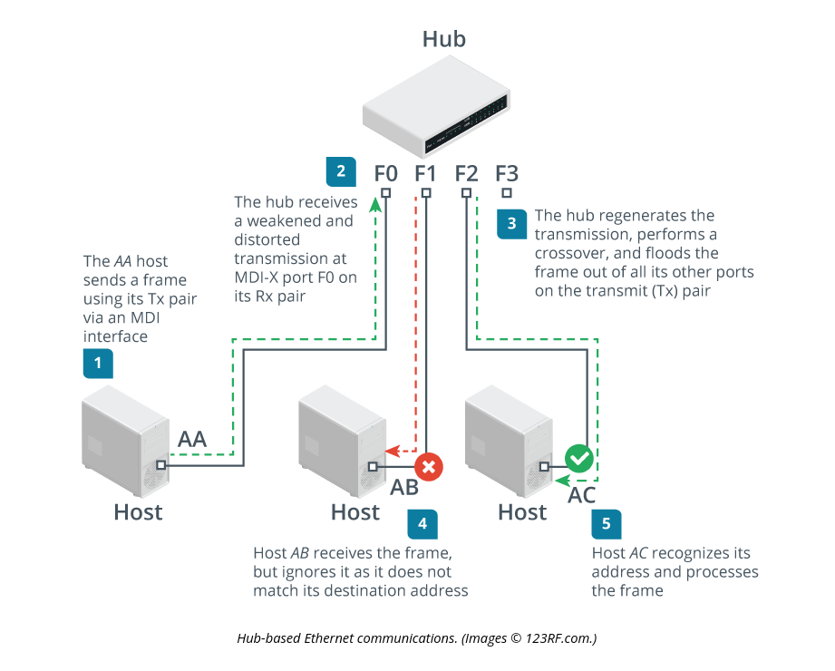

# Hubs

## Summary

Hubs are "dumb" devices in that they provide no filtering or logic for "who" or "what" gets a signal transmitted. All devices connected to the hub get the signal. Hubs are much less used because they are inefficient. 

## Bandwidth

A large downside to a hub is that it can become a bottleneck for a network as all connections share the same collision domain. This is a result of the hub not knowing where to route traffic and so it's assumed that each connection will have the same speed because of the "chatty" nature of the Hub.

