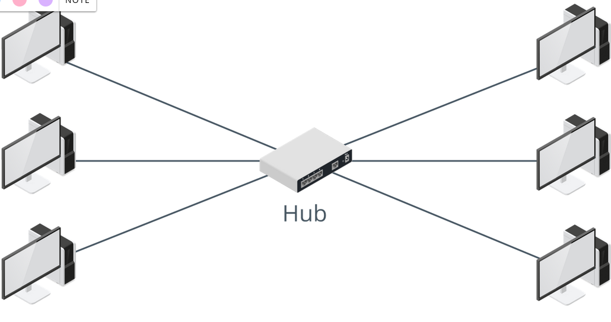

# Review Activity: Networking Devices

[Quizlet](https://quizlet.com/929662280/repeaters-and-media-converters-flash-cards/?i=3896f3&x=1qqt)

1. You need to run UTP cable between two switches at opposite ends of a warehouse that is 140 m (459 feet) long. What additional device (if any) is required for the installation to be compliant with 1000BASE-TX Ethernet standard?

> The maximum link length is 100 m (328 feet) so a repeater will be needed.

2. True or false? All the nodes shown in the following figure are in the same collision domain.

> True. Hubs work at the physical layer (layer 1) and just repeat the same signal out of each port.

4. True or False? Devices can only transmit on an Ethernet network when the media is clear, and the opportunity to transmit becomes less frequent as more devices are added. Also, the probability of collisions increases. These problems can be overcome by installing a hub. 

> False. The description of the problem is true, but the solution is not. This issue is resolved by using a bridge or (more likely these days) a switch.

5. True or false? A bridge does not forward broadcast traffic. 

> False. Segments on different bridge ports are in separate collision domains but the same broadcast domain.
