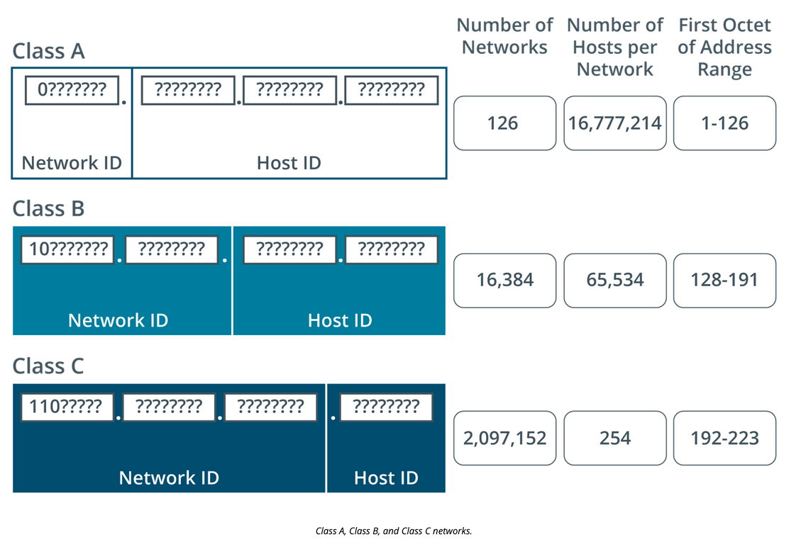

# Configure IP Networks and Subnets

[quizlet](https://quizlet.com/949632833/comptia-network-n10-008-configure-ip-networks-and-subnets-flash-cards/?new)

## Objectives

1.4. Given a scenario, congigure a subnet and use appropriate IP addressing schemes.

## Summary

Networks can use subnets to reduce traffic and increase performance over specific networks. Removing or blocking traffic also provides the ability to 

## Virtual Lans and Subnets

Virutal LANs (Vlans) are configured virtual networks on the same physical appliances. Virtual lans allow for breaking up traffic into two different groups based on subnets and forward traffic based on subnet goals. 

Virtual LANs can allow for networking teams to save cost on physical devices and not have to purchase several switches to route traffic based on the host machines attached. Instead they can use virtual appliances to route traffic.

## Class Addressing

Classful addressing scheme was created in 1980 as a way of allocating network IDs based on the first octet of the IP (Internet Protocol) address.

Class addressing has an inverse usage of hosts to number of networks. The more networks available, the less hosts that can be on the network. The more hosts on the network the less networks that can be assigned.

## Public Versus Private Addressing

Public Addresses are provided by IANA and administrated by regional registries and ISPs. Public addresses can establish connects to larger networks such as MANs or WANs

Private addresses are ones that cannot be used over the internet. Common octet schemes are

10.0.0.0 to 10.255.255.255 (Class A Private address range)
172.16.0.0 to 127.31.255.255 (Class B Private address range)
192.168.0.0 to 192.168.255.255 (Class C private address rnage)

## Automatic Private IP Addressing (APIPA)

A hosts IP configuration can either be applied statically or it can use an autoconfiguration method. Autoconfiguration on an IPv4 network usually means using a Dynamic Host Configuration Protocol (DHCP) server.

## IPv4 Address Scheme Design

Factors to take in when designing an address scheme

1. the number of IP (internet protocol) networks and subnetworks required
2. the number of hosts per subnet that must be supported
3. the network ID must be from a valid public or private range
4. the network and/or host IDs cannot be all 1's in binary this is reserved for broadcasts
5. the network and/or host ID cannot be all 0s in binary; 0 means "this network"
6. each host ID must be unique on the IP network or subnet
the network ID must be unique on the interent (if you are using a public addressing scheme) or on your internal system of internetworks (ifyou are using a private addressing scheme)

## Review Activity

1. True or False? The IP address 172.24.0.1 is routable over the Internet. 

> False. 172.16.0.0—172.31.255.255 is the Class B private address range.

2. What is a Class D address? 

> One used for multicasting.

3. What is the significance of the address 127.0.0.1? 

> This is the default loopback address for most hosts. The loopback address facilitates testing the TCP/IP implementation on a host.

4. A host is configured with the IP address 10.0.10.22 and subnet mask 255.255.255.192. How many hosts per subnet would this addressing scheme support? 

> 62. Either subtract the least significant octet from 256 (256-192=64), then subtract 2 for the network and broadcast addresses, or having worked out that there are 6 host bits, calculate 26-2.

5. If the IP address 10.0.10.22 were used with an /18 mask, how many subnets and hosts per subnet would be available? 

> 1024 subnets each with 16,382 hosts. From the default mask, 10 bits are allocated to the subnet ID and 14 remain as host bits.

## More review activities

At the 515support branch office, you have been asked to implement an IP network. Your network ID is currently 198.51.100.0/24. You need to divide this in half (two subnets) to accommodate hosts on two separate floors of the building, each of which is served by managed switches. The whole network is served by a single router. 

Using the above scenario, answer the following questions:

1. to divide the network in half, what subnet mask do you need to use?

> Adding a single bit to the mask creates two subnets. The mask and network prefix will be 255.255.255.128 (/25). 

2. what are the subnet IDs for each network

> 198.51.100.0 /25 and 198.51.100.128 /25. An easy way to find the first subnet ID is to deduct the least significant octet in the mask (128 in the example) from 256, giving the answer 128. 

3. what is the broadcast address for each subnet

> You can work these out quite simply from the subnet ID that you calculated. The broadcast address for the first subnet is 1 less than the next subnet ID. The second subnet's broadcast address is the last possible address. 

4. what is the range of assignable IP addresses for each subnet

> 198.51.100.1 to 126 and 198.51.100.129 to 254. If you have each subnet ID and the broadcast ID, the host ranges are simply the values in between. 

5. Your manager has considered his original plan and realized that it does not accommodate the need for a WAN link to the head office or a separate segment for a team that works with sensitive data. What mask will you need to accommodate this new requirement, and how many hosts per subnet will it allow?

> You now need four subnets. Adding one bit to the mask will double the available subnets from two to four. A /26 prefix or 255.255.255.192 mask leaves six bits left to work with for host addressing, so 62 host addresses will be available per subnet.
