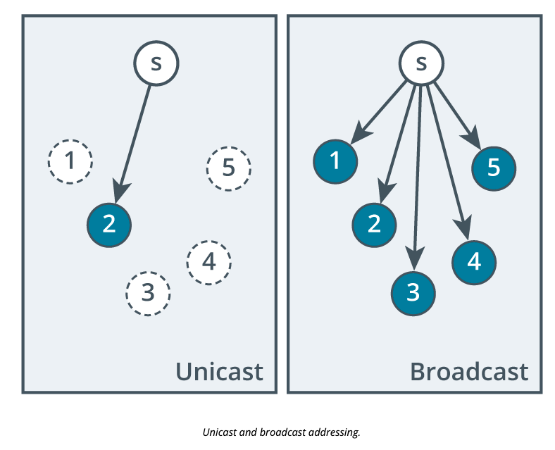
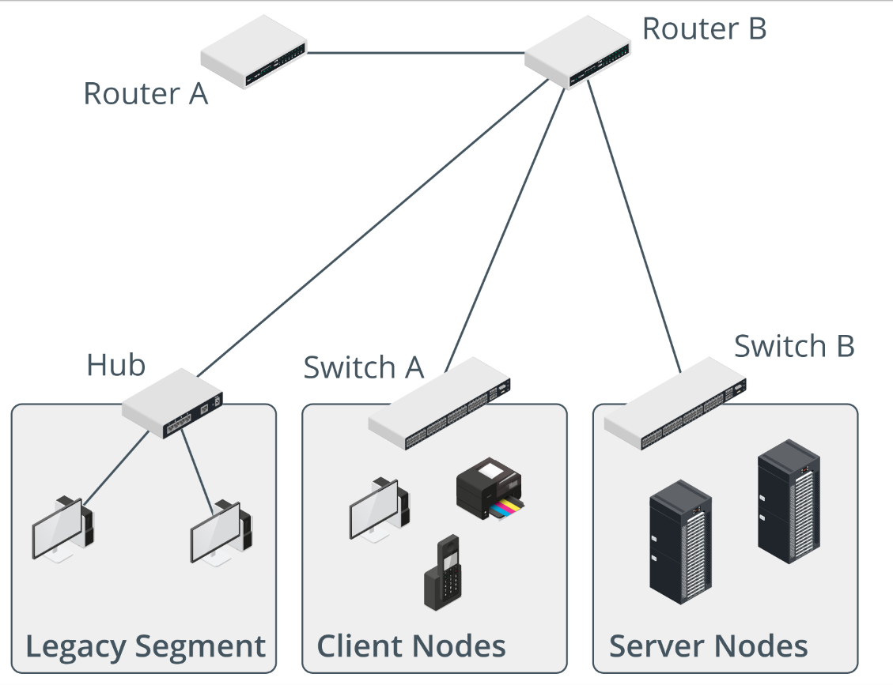

# Explain IPv4 Forwarding

[quizlet](https://quizlet.com/949613356/comptia-network-n10-008-explain-ipv4-addressing-flash-cards/)

In this topic you will understand how IP (internet protocol) addresses are forwarded to different destinations

## Objectives

1.4 Given a scenario, configure a subnet and use appropriate IP addressing schemes.

## Sections

### Layer 2 Versus Layer 3 Addressing and Forwarding

- **Routing** is defined as layer 3 forwading
- **Switching** is defined as layer 2 forwarding

### IPv4 Default Gateways

A **Default gateway** is a device that is forwardeded packets which do not match when attemping to AND the netmask and the host IP address. If the subnets are different this gateway handles forwarding to other subnets or logical networks. This process repeats until the destination is reached.

Two host systems know if the address is on the same logical network if they can compare the netmask of the source and destination IP (Internet Protocol) addresses. If they match then the destination interface is assumed to be on the same network or subnet.

### Address Resolution Protocol

Address Resolution Protocol (ARP) is used as a way of forwarding traffic at layer 1 and layer 2. Packets or frames of information must make it to their destinations by hardware addresses such as MAC (Media Access Control) Addressses. 

ARP only takes place when both the source and destination host systems are on the same broadcast domain or subnet.

### Unicast and Broadcast Addressing

Peer-to-Peer communication can be accomplished by having packets addressed to specific hosts called a *unicast packet* When a packet needs to be sent to multiple hosts it is called "broadcasting" packets on a network.

legacy hardware such as hubs and switches will broadcast messages because they have no concept of routing packets or where addresses are so they need to forward on all ports except the osurce port.

### Multicast Addressing

Multicasting happens when several subscribers to a specific message are listening on a network for packets of information from a specific host. A host can multicast with a ragne of MAC (Media Access Control) Addresses on a network which then are targeted to those specific hosts.

For switches that are layer 2 that are "dumb" switches there is no difference between multicast and broadcasting because the network will always get flooded with all packets. 

### Anycasting

Anycast means tht a group of hosts are configured with the same IP (Internet Protocol) Address. when a router forwards a packet to an anycast group, it uses a prioritization algorithm and metrics to select the host that is "closest"

### Review Activity

1. Given the subnet mask 255.255.255.128, are the IP addresses 192.168.0.1 and 192.168.1.1 on the same network? 

> No. Compare the decimal mask and dotted decimal IP addresses and note that the third octet is within the network portion but is different for each IP address. If you do convert to binary to check, remember that the subnet mask contains 25 bits. You can see that the 24th bit is different in each address. As that bit occurs within the netmask, the hosts are on different IP networks.

2. If a packet is addressed to a remote network, what destination MAC address will the sending node use to encapsulate the IP packet in a frame?

> The MAC address of the default gateway.

3. Assuming unmanaged switches, how many broadcast domains are present in the following figure?

> Four. Each router interface is a separate broadcast domain. One broadcast domain contains Router A and Router B, another contains the nodes on the legacy segment, and the last two are the client nodes Switch A broadcast domain and the server nodes Switch B broadcast domain.

4. If a host is configured with the IP address 10.0.10.22 and mask 255.255.255.192, what is the broadcast address of the subnet? 

> 10.0.10.63. Convert the IP address to binary (00001010 00000000 00001010 00010110), then work out the number of bits in the mask (26). Change the remaining host bits (6) to 1s and convert back to dotted decimal.

5. What type of addressing delivers a packet to a single host from a group without using unicast?

> Anycast means that a group of hosts are configured with the same IP address. When a router forwards a packet to an anycast group, it uses a prioritization algorithm and metrics to select the host that is "closest" (that will receive the packet and be able to process it the most quickly).