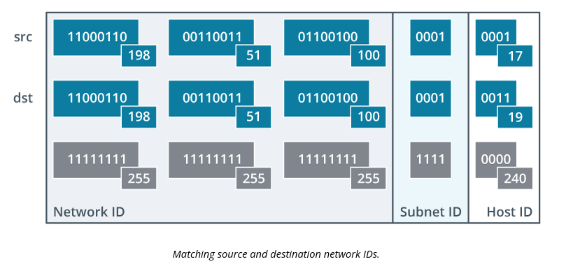
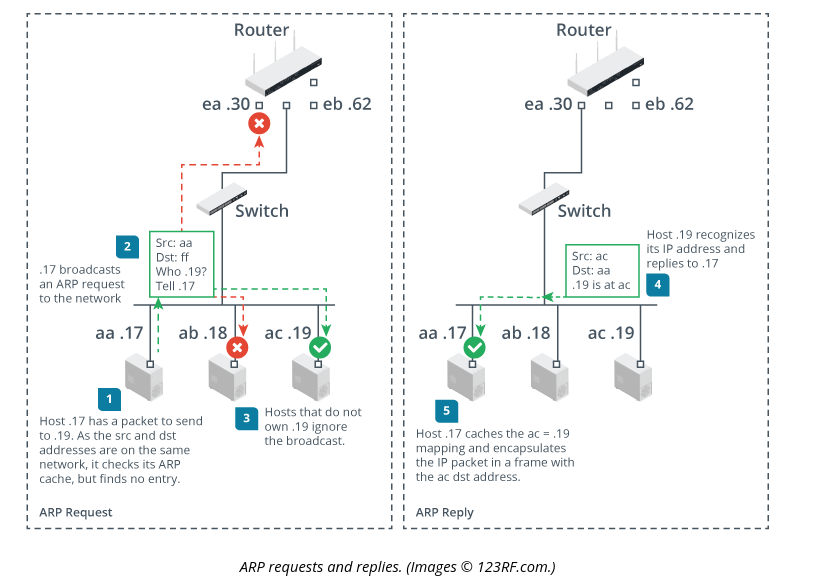

# Explain IPv4 Forwarding

In this topic you will understand how IP (internet protocol) addresses are forwarded to different destinations

## Objectives

1.4 Given a scenario, configure a subnet and use appropriate IP addressing schemes.

## Sections

### Layer 2 Versus Layer 3 Addressing and Forwarding

- **Routing** is defined as layer 3 forwading
- **Switching** is defined as layer 2 forwarding

### IPv4 Default Gateways

A **Default gateway** is a device that is forwardeded packets which do not match when attemping to AND the netmask and the host IP address. If the subnets are different this gateway handles forwarding to other subnets or logical networks. This process repeats until the destination is reached.

Two host systems know if the address is on the same logical network if they can compare the netmask of the source and destination IP (Internet Protocol) addresses. If they match then the destination interface is assumed to be on the same network or subnet.

### Address Resolution Protocol

Address Resolution Protocol (ARP) is used as a way of forwarding traffic at layer 1 and layer 2. Packets or frames of information must make it to their destinations by hardware addresses such as MAC (Media Access Control) Addressses. 

ARP only takes place when both the source and destination host systems are on the same broadcast domain or subnet.

### Unicast and Broadcast Addressing

