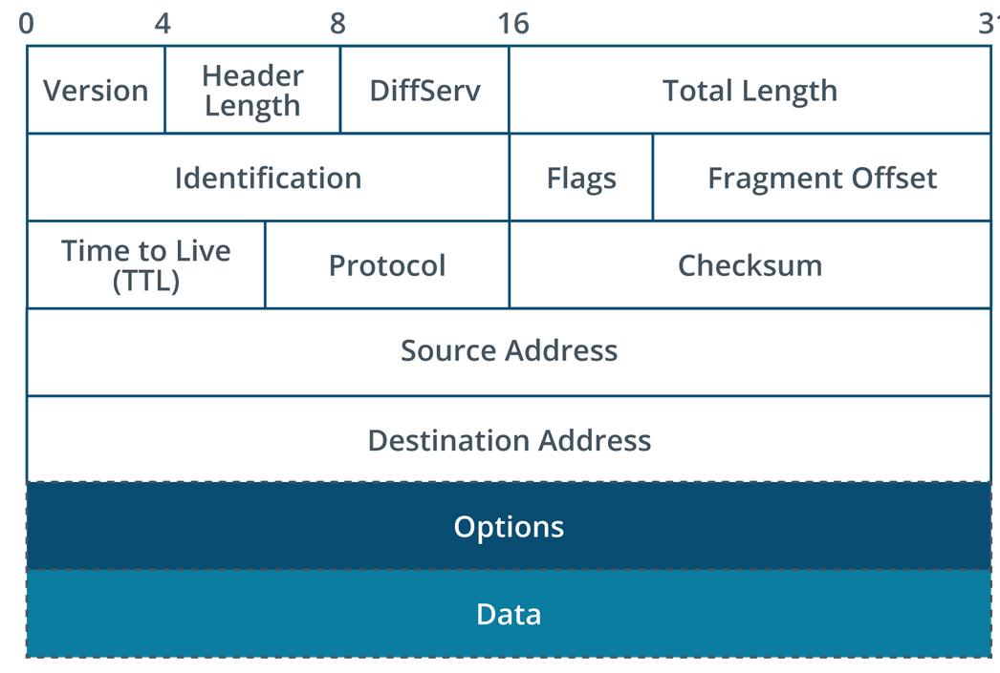

# IPv4 Datagram Header

## Summary

Internet Protocol header cotnains fields to manage the logic addressing and forward function for places such as source and distination address for packets. IPv4 is implemented at the layer 3 protocol layer.

## Protocols that run directly on Internet Protocol

- Interent Control Message Protcol (ICMP/1) used for status messaging and connectivity testing
- Internet Group Messaging Protocol (IGMP/2) is used with multicasint
- Generic Routing Encapsulation 9GRE/47) is used to tunnel packets across an intermediate network.
- Encapsulating Security Payload 9ESP/50) and Authentication Header (AH/51) are used with the encrypted form of IP (IPSec)
- Enhanced Interior Gateway routing Protocol (EIGRP/88) and Open Shortest Path First (OSPF/89) are protocols used by routes to exchange information about paths to remove networks.