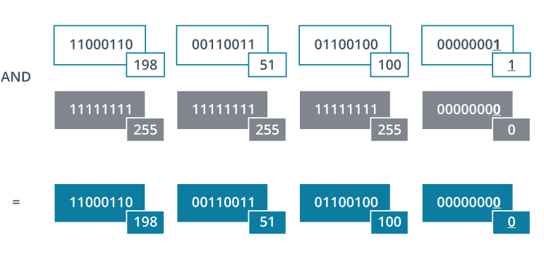

# Network Masks

## Summary

network masks are a way of hiding host addresses while still exposing the network id portion of an address. Network ID portion of an IP address is revealed by ANDing the mask to the IP address.

