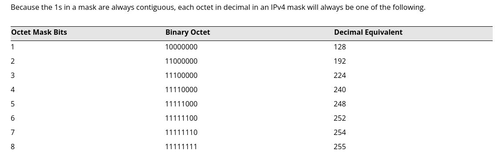

# Subnet Masks

## Summary

There are three parts to Subnet Addressing, network ID, subnet ID, and host ID. Most people do not remember how addresses are divided on a logical network, rather spread sheets are often used to help calculate usable ranges.

See https://www.calculator.net/ip-subnet-calculator.html

