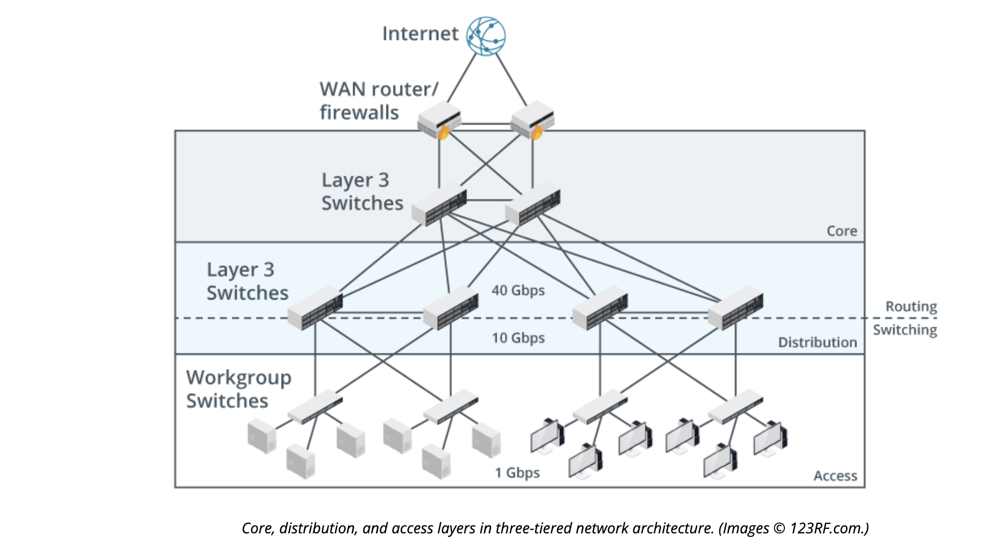
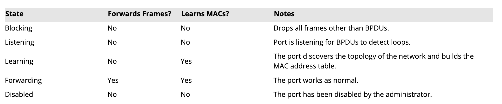

# Explain Tiered Switching Architecture 

## Objectives

1.7 Explain basic corporate and datacenter network architecture.
2.3 Given a scenario, configure and deploy common Ethernet switching features. (STP only)
5.5 Given a scenario, troubleshoot general networking issues.

## Three Tierd Topology

Many companies follow Cisco's three tierd method with Access Edge Layer, Distribution/Aggregation Layer, and Core Layer.

### Edge/Access Layer Layer

Allow endpoint systems such as desktops, laptops, phones, IoE devices, security systems, etc.

### Distribution Layer

Distribution layer contians traffic polocies such as routing rules, firewalls, Quality of Service (QoS), VLANs, etc. which can help divert traffic more effectively. 

### Core Layer

Core layer is a fault tolerant and redudant layer that maintains connections between an Internet Service Proider (ISP) and the internal network and distribution layer.

## Spanning Tree Protocol

Spanning Tree Protocol (STP) allows for bridges/switches to self identify in a tree of other nodes and understand where they live inside of a network. Systems use something called a Bridge Protocol Data Unit (BPDU) multicast frames to fetch resposnes from other nodes on the network to understand their place.

### Configuration

Not all switches support configuration. Some that do should be setup by an administrator to be identified as the root switch node for all other switches.

## Broadcast Storm

A broadcast store occurs when switches are looping frames to each other an unable to determine the exact place to which they should be forwarding frames. Because layer 2 switches do not have the concept of a Time to Live (TTL) the frames will continue to be forwarded.

If a broadcast storm occurs on a network where STP is already enabled, you should investigate the following potential causes:

- Verify compatible versions of STP are enabled on all switches.
- Verify the physical configuration of segments that use legacy equipment, such as Ethernet hubs.
- Investigate networking devices in the user environment and verify that they are not connected as part of a loop. Typical sources of problems include unmanaged desktop switches and VoIP handsets.

## Review Activity

1. Which two topologies are used in the three-tier hierarchical model?

> This is a hybrid topology with mesh and star elements. The core layer is a mesh and the links between core and distribution and distribution and access are also a mesh or partial mesh. The access switches use a star topology to connect end systems.

2. Spanning tree has been deployed without the administrator setting a priority value. Which of the following switches will be selected as the root?

    - Switch A with base MAC f062.81ff.0001 and a 10 Gbps uplink
    - Switch B with base MAC f062.81ff.0002 and a 40 Gbps uplink
    - Switch C with base MAC f062.81ff.0003 and a 40 Gbps uplink

> Switch A. The switch with the lowest value MAC address is selected if priority values are equal.

3. In what STP-configured state(s) are all ports when a network running STP is converged?

> Forwarding and blocking

4. True or false? A broadcast storm can only be resolved by investing interface configurations.

> False. A broadcast storm could be caused by a physical layer issue, such as improper cabling. 