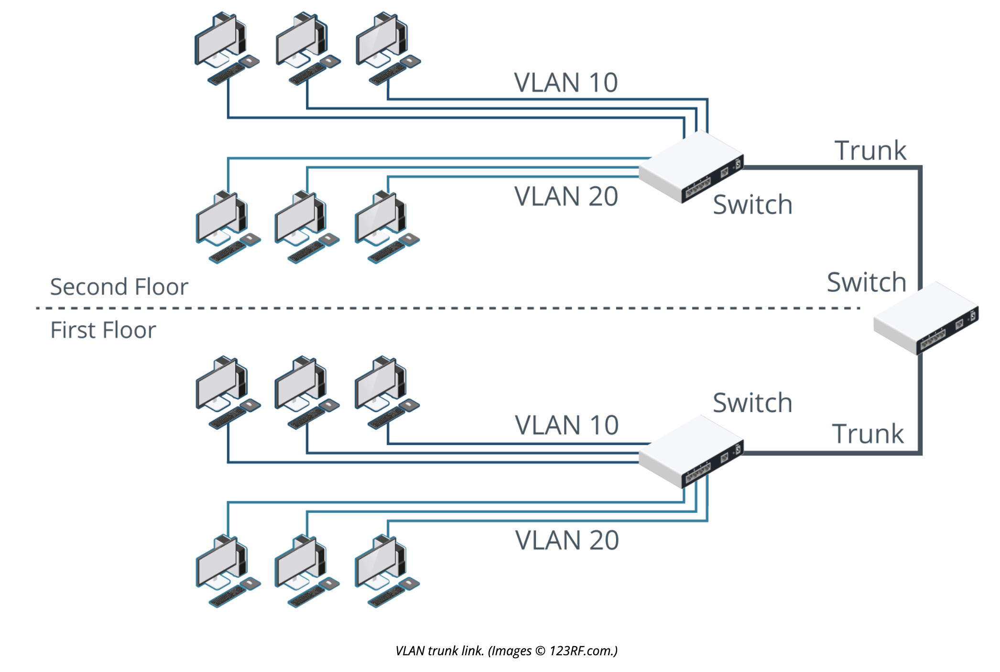

# Explain Virtual LANs

## Objectives

 - 2.3 Given a scenario, configure and deploy common Ethernet switching features.

## Virtual LAN IDs and Membership

The VLAN with ID 1 is referred to as the default VLAN. Unless configured differently, all ports on a switch default to being in VLAN 1.

The simplest means of assigning a node to a VLAN is by configuring the port interface on the switch with a VLAN ID in the range 2 to 4,094.

## Trunking and IEEE 802.1Q

Trunks are the backbone link established between switches and routers to transport frames for multiple virtual LANs (VLANs).

Under 802.1Q, per-VLAN traffic is identified by a tag inserted in the Ethernet frame between the Source Address and EtherType fields. The tag contains information about the VID (from 1 to 4,094) and priority (used for QoS functions). The EtherType value is set to identify the frame as 802.1Q.

## Port Tagging

An untagged port is the "host" port of which a switch may be liked to another switch.

### Logic

- If a frame is addressed to a port in the same VLAN on the same switch, no tag needs to be added to the frame.
- If the frame needs to be transported over a trunk link, the switch adds the relevant 802.1Q tag to identify the VLAN, and then forwards the frame over the trunk port.
- If the switch receives an 802.1Q tagged frame on an access port, it strips the tag before forwarding it.

## Review Activity

1. At which layer of the OSI model do VLANs establish network segments?

> At the data link layer or layer 2.

2. True or false? A VLAN is a single broadcast domain.

> True

3. Which values can be used to assign a port to a specific VLAN?

> From 2 to 4,094. The all zeros and all ones (0 and 4,095) are reserved and VLAN ID 1 is the default for all unconfigured ports.

4. What type of frames are carried over tagged ports?

> Tagged ports typically operate as trunks to carry frames between VLANs on different switches. Frames are transported over the trunk link with an 802.1Q header to indicate the VLAN ID.

5. True or false? When configuring a voice VLAN, the voice VLAN ID must be lower than the access VLAN ID.

> False. The IDs only need to be distinct and synchronized with the IDs expected by the switch.