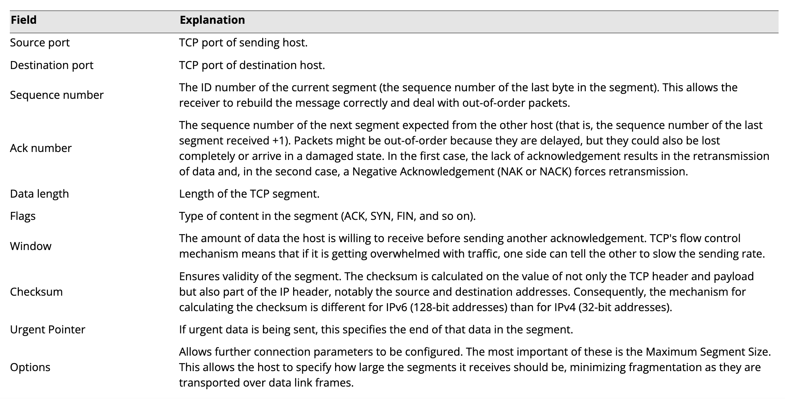

# Explaining Transport Layer Protocols

## Objectives

- 1.1 Compare and contrast the Open Systems Interconnection (OSI) model layers and encapsulation concepts.
- 1.5 Explain common ports and protocols, their application, and encrypted alternatives.

## Transport Layer Ports and Connections

### Ports

Port numbers 0 through 1,023 are preassigned by the Internet Assigned Numbers Authority (IANA) to "well-known" server applications. Other server applications have been registered in the port range 1,024 through 49,151. The remaining ports (up to 65,535) are designated for private or dynamic use.

### Sockets

- The port number is used in conjunction with the source IP address to form a socket.
- Each socket is bound to a software process. Only one process can operate a socket at any one time.

## Transmission Control Protocol (TCP)

Transmission Control Protocol is a "slower" protocol of the two between it and UDP, but is more reliable to ensure missing critical information reaches its destination.

### TCP Port Fields

