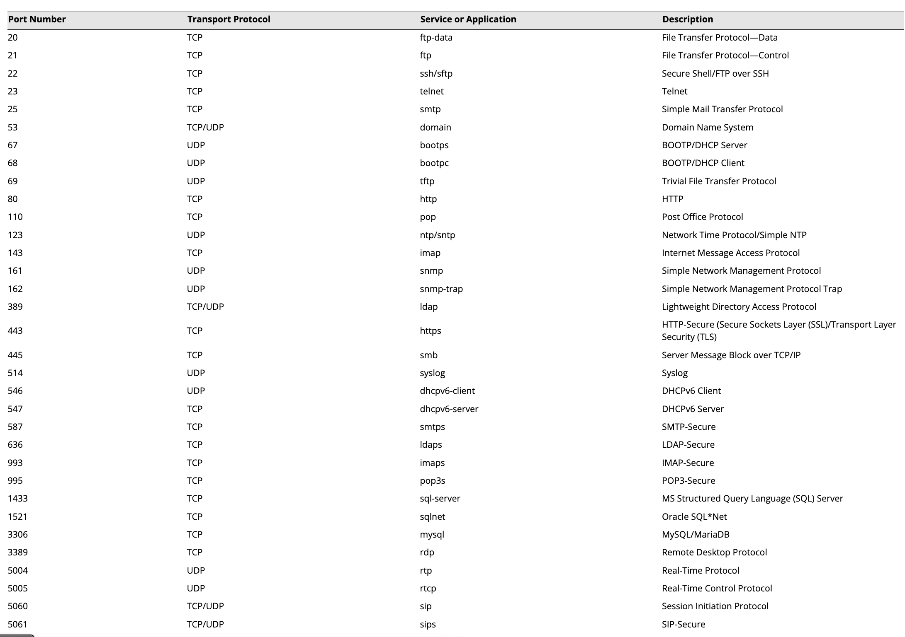

# Compare and Contrast Transport Protocols

[quizlet](https://quizlet.com/964886628/comptia-network-n10-008-transport-protocols-flash-cards/?i=3896f3&x=1jqt)

## Objectives

- 1.1 Compare and contrast the Open Systems Interconnection (OSI) model layers and encapsulation concepts.
- 1.5 Explain common ports and protocols, their application, and encrypted alternatives.

## Transport Layer Ports and Connections

### Ports

Port numbers 0 through 1,023 are preassigned by the Internet Assigned Numbers Authority (IANA) to "well-known" server applications. Other server applications have been registered in the port range 1,024 through 49,151. The remaining ports (up to 65,535) are designated for private or dynamic use.

### Sockets

- The port number is used in conjunction with the source IP address to form a socket.
- Each socket is bound to a software process. Only one process can operate a socket at any one time.

## Transmission Control Protocol (TCP)

Transmission Control Protocol is a "slower" protocol of the two between it and UDP, but is more reliable to ensure missing critical information reaches its destination.

### TCP Port Fields

## TCP Handshake Breakdown

A three way handshake is made to establish a connection for TCP

1. Client sends a SYN TCP Flag and enteres SYN-SENT state with a randomly generated sequence number
2. Server receives the SYN and enters the SYN-RECEIVED state. It then responds with a SYN/ACK TCP flag of it's own back to the client with a randomly generated sequence number.
3. Client responds with an ACK segment and assumes the connection has been established.
4. Server opens up the connection and enters the Established state.

While a connection has been established the client sends packets to the server. If the client doesn't receive an ACK for the packets sent then the client resends the packet.

## TCP Connection Teardown

1. Client sends a FIN segment and the client enters a FIN-WAIT1 state
2. Server responds with ACK segment and enters CLOSE-WAIT state
3. Client receives the ACK segment and enters the FIN-WAIT2 state
4. The server sends it's own FIN segment to the client and goes to LAST-ACK state
5. Client sends an ACK and enters the TIME-AWAIT state. After a time of period the client closes the connection.
6. Server closes the connection when it receives the ACK 

## User Datagram Protocol (UDP)

UDP is "connectionless" meaning that there is no guarantee of a successful packet delivery occuring or a retransmission request occuring.

## Review Activity: 

1. How many port numbers are required to establish a connection at the Transport layer?

> Two—a server port and a client port.

2. What is the purpose of the window field in a TCP segment?

> It is used for flow control. The window indicates the amount of data that the host can receive before sending another acknowledgement.

3. What are the sizes of TCP and UDP headers? 

> TCP is 20 bytes (or more) while UDP is 8 bytes.

4. True or False? User Datagram Protocol (UDP), like TCP, uses flow control in the sending of data packets.

> False.

5. What port and protocol does TFTP use at the Transport layer?

> UDP/69
