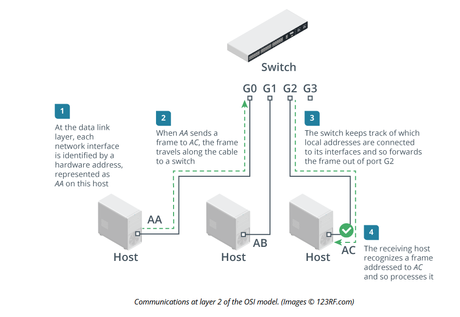

# Layer 2 - Data Link Layer

## Summary

The Data Link Layer provides the fundamentals for packets to get to where they need to be based on address alone. In a Data Link topology multiple physical nodes/segments may be connected at a hub and then forward packets as necessary to their destinations.

## Frames

The Data Link Layer attaches a header to a packet which has three different components

- Source and Destination - Where did the packet come from and where is it trying to get to in the form of **Hardware Addresses**
- Error Checking - Did the package make it between it's nodes without any issues.

## Device Types

- Network adapter or network interface card (NICs) - Usually installed in a source or destination host which provides an interface for sending/receiving signals/
- Bridge - System for joining multiple networks together via ports or NICs.
- Switch - Advanced version of a bridge which can more efficiently send/revieve signals.
- Wireless Access Point (AP) - Create a connection between two Wireless Networks or also wired ones.